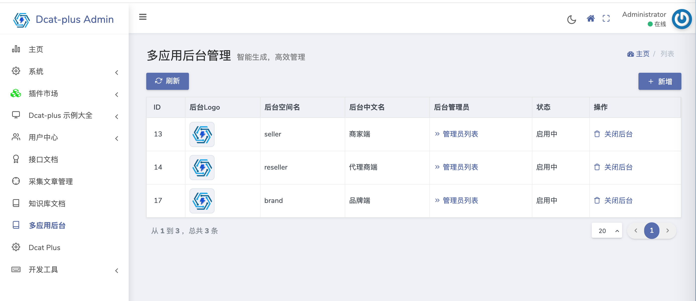
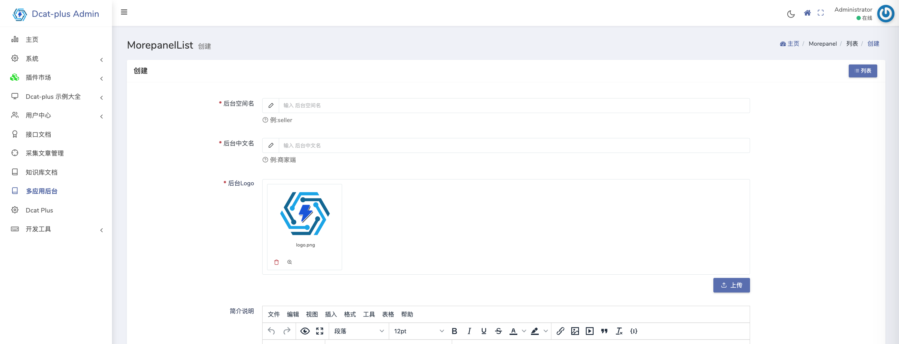
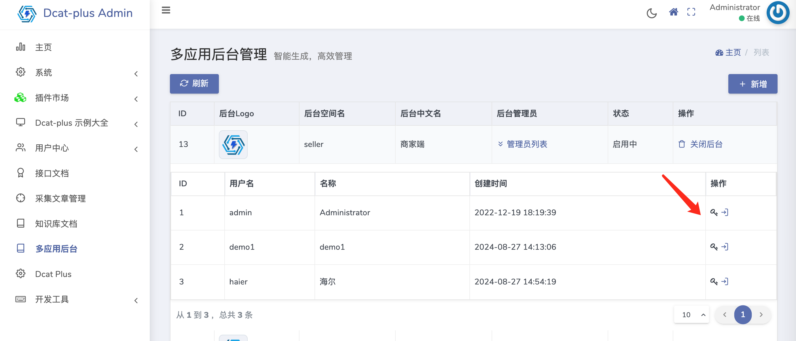
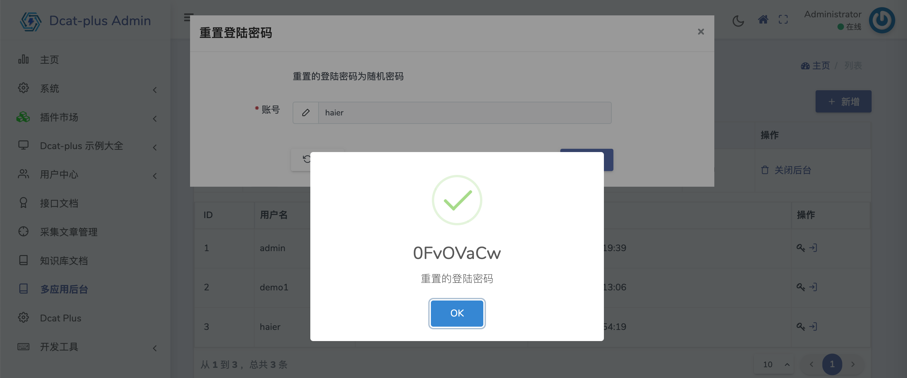

<div align="center">
     
</div>
<br>

### 基于到Dcat admin 的多应用管理器

1.可视化创建后台面板,可创建N个，每个后台面板有自己独立的用户，权限，角色，菜单，登陆页面。功能与admin后台面板一致。
2.在管理页面，可以给管理用户重置登陆密码。
3.在管理页面，可以免密登陆每个管理账号。

### 截图




### 环境
 - PHP >= 7.1.0
 - Laravel 5.5.0 ~ 9.*
 - Fileinfo PHP Extension

### 安装
```bash
composer require --dev ycookies/morepanel
```

### 使用
> 1.让新创建的面板，可以正常使用，需要在 `config/admin.php`中,添加如下代码。

```php
'multi_app' => [
        'seller' => true, // 新创建的后台面板空间名，并设置为true; 
        /*'reseller' => true,
        'seller' => true,
        'brand' => true,
        'cooperate' => true,*/
    ],

```

> 2.为了免密自动登陆账号后台，需要在 `routes/web.php` 中 添加如下代码

```php
Route::get('/autologin/{panel}/{user}',\Dcat\Admin\Morepanel\Http\Controllers\MorepanelController::class.'@autologin')->name('panelautologin')->middleware('signed');
```


